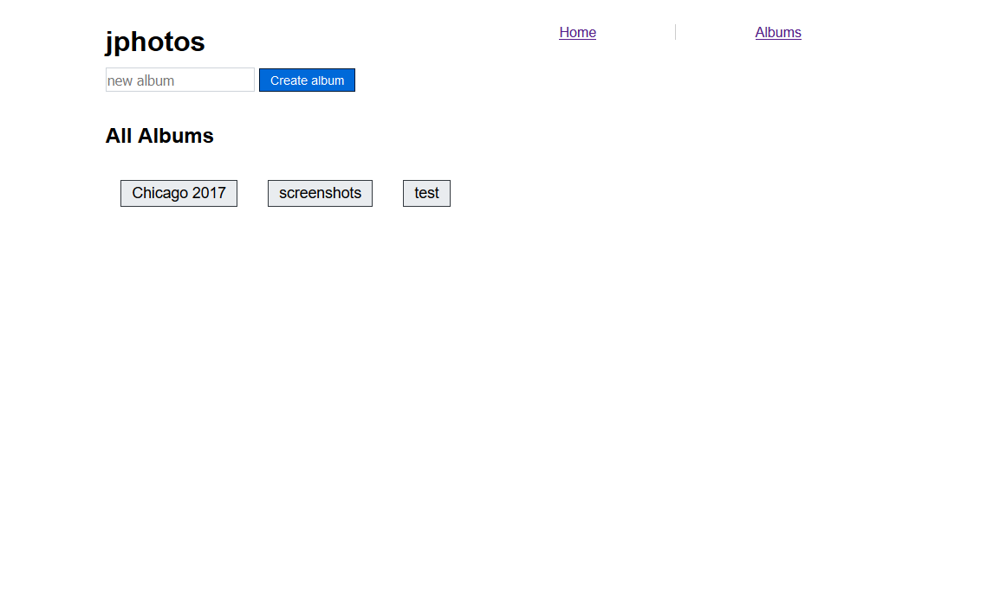
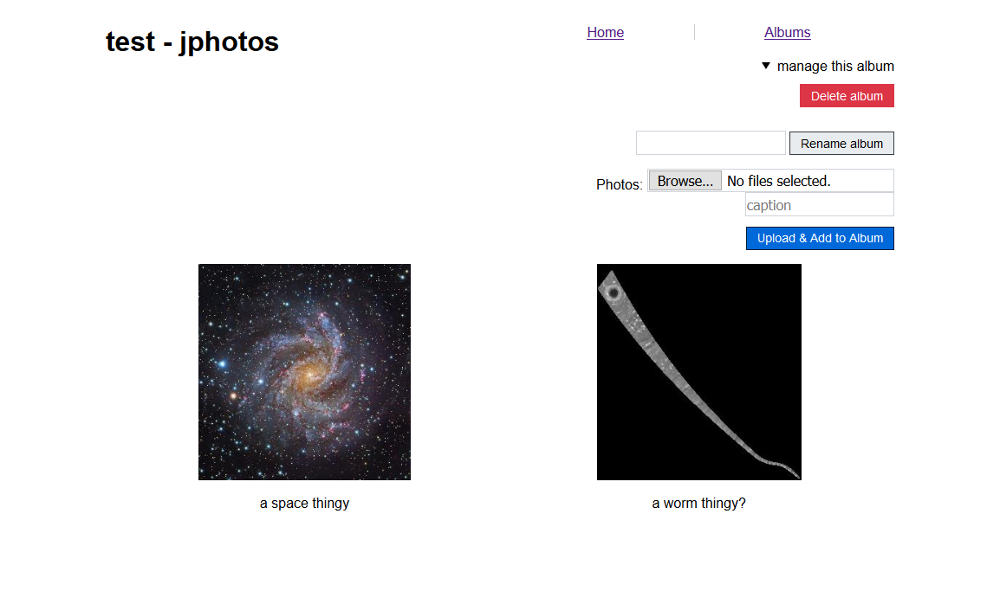
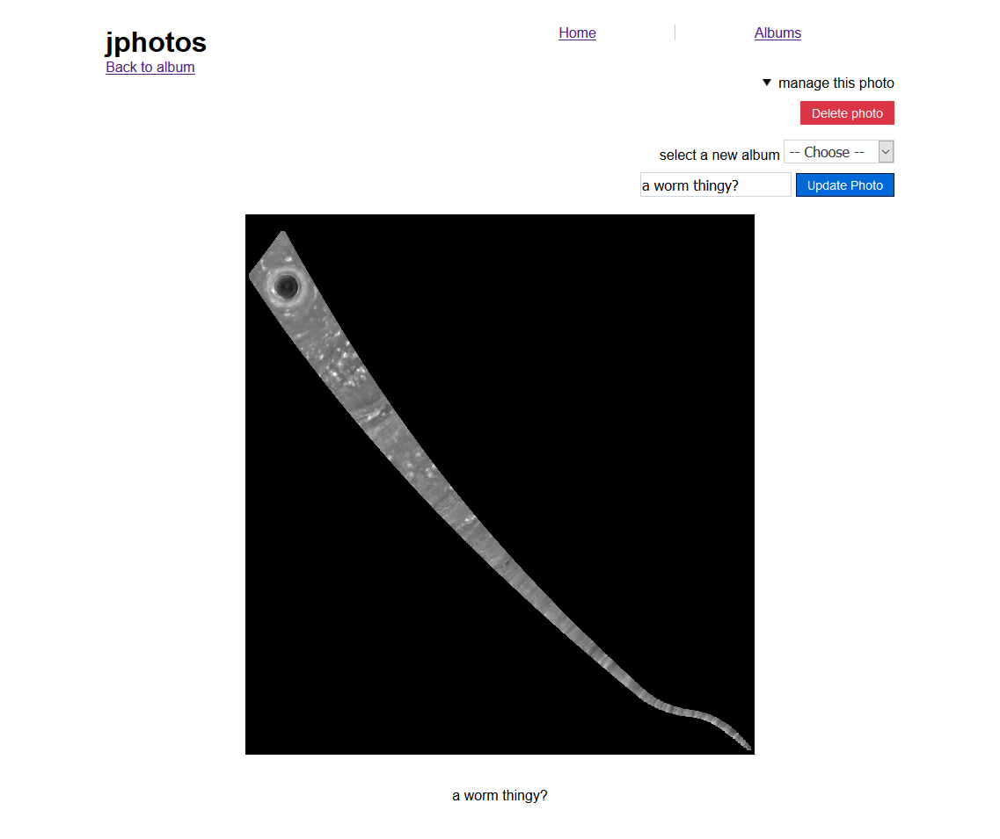

# jphotos

jphotos is a simple HTTP server for photo albums.

## Features

* No "social media" features
* No JavaScript!
* Blazing fast

## Getting Started

Read our [**Getting Started**][getting-started] guide.

Interested in developing? Get started with our [developer documentation][dev-docs].

[getting-started]:https://github.com/prplecake/jphotos/wiki/Getting-Started
[dev-docs]:https://github.com/prplecake/jphotos/wiki/Developing:-Getting-Started

## Resources

Comprehensive documentation [can be found here][wiki].

[wiki]:https://github.com/prplecake/jphotos/wiki

## Screenshots

As you can see, this project is still very much a work in progress!

**Homepage/Albums Index**

**Album View**

**Single Photo View**

